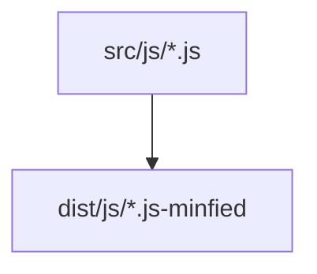
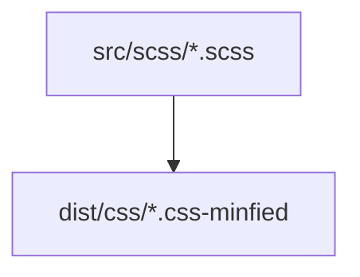
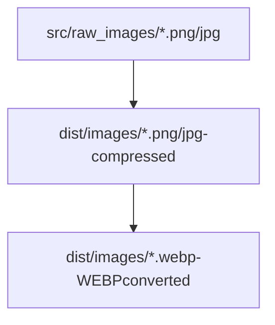

<p align="center">
  <a href="https://gulpjs.com">
    
  </a>
  <p align="center">The streaming build system</p>
</p>

## What is gulp?

- **Automation** - gulp is a toolkit that helps you automate painful or time-consuming tasks in your development workflow.
- **Platform-agnostic** - Integrations are built into all major IDEs and people are using gulp with PHP, .NET, Node.js, Java, and other platforms.
- **Strong Ecosystem** - Use npm modules to do anything you want + over 3000 curated plugins for streaming file transformations.
- **Simple** - By providing only a minimal API surface, gulp is easy to learn and simple to use.

## Installation
- Install node latest version
- Download the repo and then install the packages with below command
```
npm install
```
- Install Gulp with below command
```
npm install -g gulp
```
- Run command to compile sample code with below command
```
gulp
```
- The setup is ready, you can modify as per your need

## Process
#
#### JS -> JS (Minified)

#
#### SCSS -> CSS (Minified)

#
#### Raw_images(JPG/PNG) -> Images (Compressed JPG/PNG) -> WebP Images (Converted)

