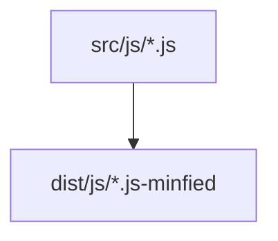
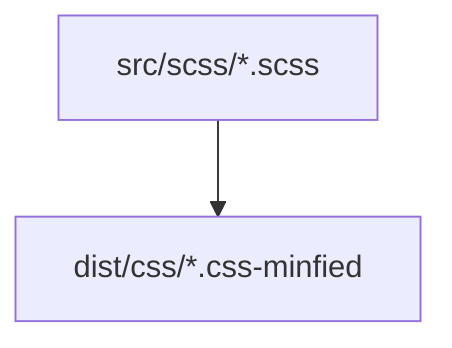
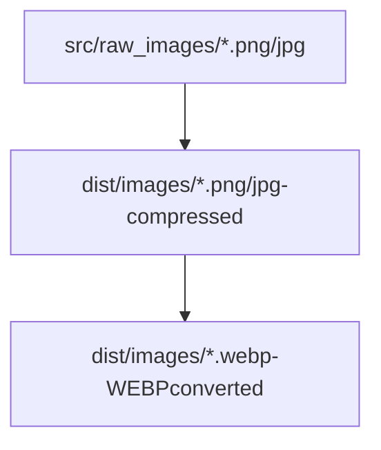

  
  
The streaming build system

[![NPM version][npm-image]][npm-url] [![Downloads][downloads-image]][npm-url] [![Azure Pipelines Build Status][azure-pipelines-image]][azure-pipelines-url] [![Build Status][travis-image]][travis-url] [![AppVeyor Build Status][appveyor-image]][appveyor-url] [![Coveralls Status][coveralls-image]][coveralls-url] [![OpenCollective Backers][backer-badge]][backer-url] [![OpenCollective Sponsors][sponsor-badge]][sponsor-url] [![Gitter chat][gitter-image]][gitter-url]

## What is gulp?

- **Automation** - gulp is a toolkit that helps you automate painful or time-consuming tasks in your development workflow.
- **Platform-agnostic** - Integrations are built into all major IDEs and people are using gulp with PHP, .NET, Node.js, Java, and other platforms.
- **Strong Ecosystem** - Use npm modules to do anything you want + over 3000 curated plugins for streaming file transformations.
- **Simple** - By providing only a minimal API surface, gulp is easy to learn and simple to use.

## Process
#
#### JS -> JS (Minified)

#
#### SCSS -> CSS (Minified)

#
#### Raw_images(JPG/PNG) -> Images (Compressed JPG/PNG) -> WebP Images (Converted)

