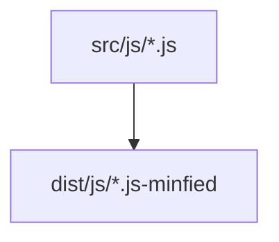
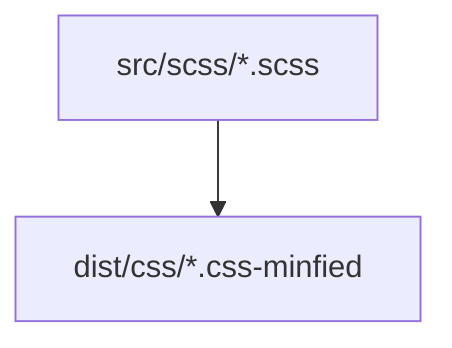
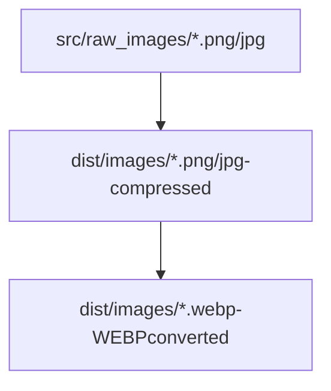

# Process
#
#### JS -> JS (Minified)

```mermaid
graph TD;
    src/js/*.js-->dist/js/*.js-minfied;
```
#
#### SCSS -> CSS (Minified)

```mermaid
graph TD;
    src/scss/*.scss-->dist/css/*.css-minfied;
```
#
#### Raw_images(JPG/PNG) -> Images (Compressed JPG/PNG) -> WebP Images (Converted)

```mermaid
graph TD;
    src/raw_images/*.png/jpg-->dist/images/*.png/jpg-compressed-->dist/images/*.webp-WEBPconverted;
```